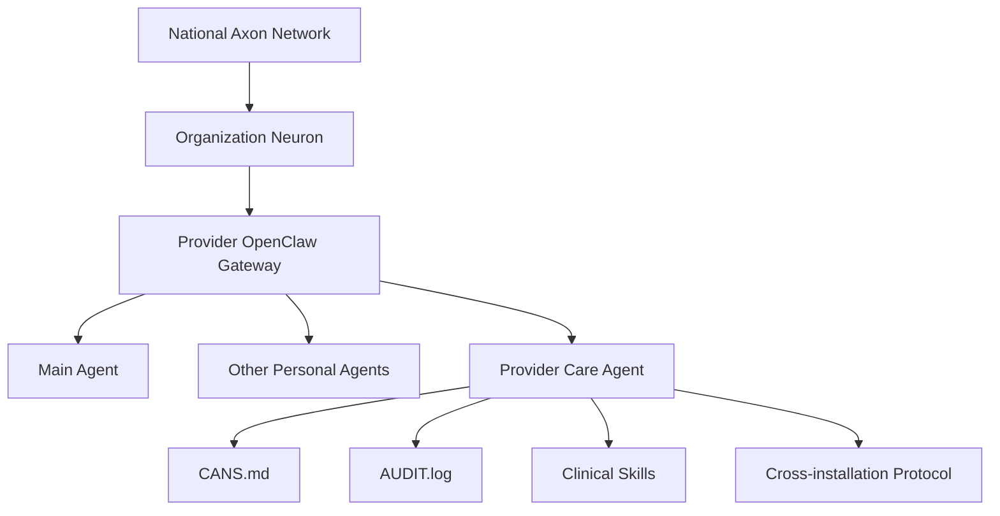
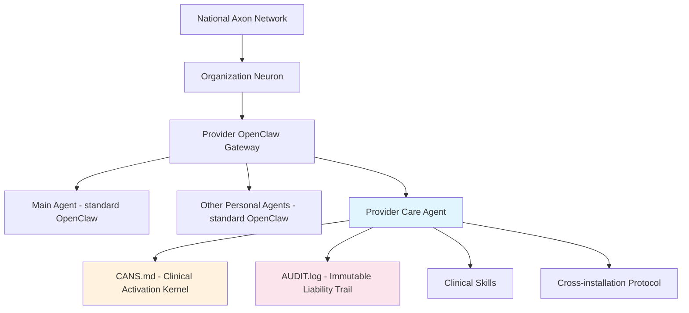
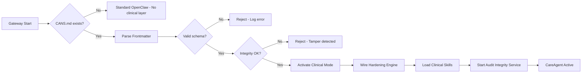
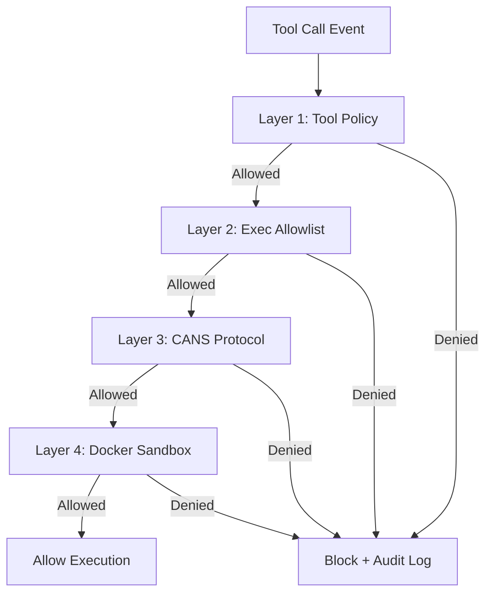

# Phase 6: Documentation and Release - Research

**Researched:** 2026-02-21
**Domain:** Technical documentation, open-source release preparation, Markdown/Mermaid authoring
**Confidence:** HIGH

## Summary

Phase 6 is a pure documentation and repository-preparation phase with no code changes to the runtime system. The codebase is feature-complete through Phase 5 — all six hardening layers, the CANS activation mechanism, clinical skills framework, audit pipeline, and refinement engine are implemented and tested. The task is to write comprehensive documentation that exposes this system to developers, contributors, and clinical IT evaluators, then prepare the repository for public open-source release.

The primary challenge is content extraction and organization: the existing README.md (~350 lines) contains substantial architectural content that must be migrated into dedicated `docs/` guides without duplication. The README must be slimmed to an overview hub with links. Secondary challenges include converting the ASCII ecosystem diagram to Mermaid, documenting the CANS.md schema with sufficient examples for independent use, and creating GitHub community health files (issue templates, PR template, CODE_OF_CONDUCT.md, CONTRIBUTING.md).

**Primary recommendation:** Structure work as content-first documentation tasks (architecture guide, installation guide, onboarding walkthrough, configuration reference) followed by open-source release artifacts, with the README slim-down as the final integration task that ties everything together with navigation links.

<user_constraints>
## User Constraints (from CONTEXT.md)

### Locked Decisions
- README becomes a slim overview with links to separate guides in docs/
- Documentation lives in `docs/` at repo root
- Existing README references (docs/architecture.md, CONTRIBUTING.md) can be restructured freely — update references to match final structure
- Configuration reference (CANS.md schema, skill metadata, plugin config): Claude decides whether single file or split by topic based on content volume
- Architecture guide targets both developers/contributors AND clinical IT evaluators — technical depth with enough context for non-developer technical leads
- Writing tone: direct and authoritative, declarative, confident, no hedging (matches current README voice)
- Code references: inline TypeScript examples for schemas and config shapes, file path references for implementation details
- Diagrams: Mermaid format (rendered by GitHub)
- Onboarding walkthrough: conceptual with key steps — explain the flow (init, interview, CANS generation, activation) with commands but without full terminal output
- Use generic "the provider" throughout — no specific specialty persona
- End point: `careagent status` showing skills active and hardened agent ready — not a full chart-skill usage example
- Happy path only — no troubleshooting section
- Create Apache 2.0 LICENSE file at repo root (copyright holder: CareAgent)
- CONTRIBUTING.md: minimal essentials — dev setup, run tests, submit PR. Short and practical.
- GitHub templates: create both issue templates (.github/ISSUE_TEMPLATE/) and PR template (.github/PULL_REQUEST_TEMPLATE.md)
- CODE_OF_CONDUCT.md: Contributor Covenant 2.1

### Claude's Discretion
- Configuration reference structure (single file vs split by topic)
- docs/ folder naming conventions and file organization beyond the decided structure
- Diagram content and placement within architecture guide
- Exact slim README structure and which sections to keep vs extract
- Issue template categories and PR template structure

### Deferred Ideas (OUT OF SCOPE)
None — discussion stayed within phase scope
</user_constraints>

<phase_requirements>
## Phase Requirements

| ID | Description | Research Support |
|----|-------------|-----------------|
| DOCS-01 | Architecture guide explains plugin model, CANS activation, hardening layers, and skill framework | Existing README contains ~60% of content; source code (gate.ts, engine.ts, cans-schema.ts, loader.ts) provides schema/type details. Mermaid diagrams replace ASCII art. Dual-audience tone (dev + clinical IT). |
| DOCS-02 | Installation guide covers OpenClaw setup, plugin installation, and VPS deployment | README has basic install commands. Must add VPS prerequisites (Node >=22.12.0, pnpm), OpenClaw installation steps, plugin install, gateway restart, and first-run verification sequence. |
| DOCS-03 | Onboarding walkthrough guides a provider through `careagent init` to first clinical interaction | Onboarding stages (src/onboarding/stages.ts) define the exact interview flow: welcome > identity > credentials > specialty > scope > philosophy > voice > autonomy > consent > complete. Document conceptually with commands, ending at `careagent status`. |
| DOCS-04 | Configuration reference documents CANS.md schema, skill metadata format, and plugin settings | CANS schema (cans-schema.ts) and skill manifest schema (manifest-schema.ts) provide TypeBox definitions. Valid fixture (valid-cans.md) provides example. Plugin manifest (openclaw.plugin.json) defines plugin config shape. |
| DOCS-05 | Repository is prepared for open-source release with LICENSE, README, CONTRIBUTING guide | LICENSE already exists (Apache 2.0). README needs slim-down. CONTRIBUTING.md, CODE_OF_CONDUCT.md, .github/ISSUE_TEMPLATE/, .github/PULL_REQUEST_TEMPLATE.md all need creation. |
</phase_requirements>

## Standard Stack

### Core

This phase has no library dependencies — it produces Markdown files, Mermaid diagrams, and GitHub community health files. All output is static content authored in Markdown.

| Tool/Format | Version | Purpose | Why Standard |
|-------------|---------|---------|--------------|
| Markdown (CommonMark/GFM) | GitHub Flavored | All documentation files | GitHub native rendering, universal developer literacy |
| Mermaid | Latest (GitHub-rendered) | Architecture diagrams | GitHub natively renders ```mermaid blocks; no build step required |
| YAML | Issue template format | GitHub issue form templates | GitHub's current standard for structured issue forms |

### Supporting

| Tool | Purpose | When to Use |
|------|---------|-------------|
| TypeBox schema (read-only reference) | Schema source of truth for CANS.md and skill manifest documentation | When documenting configuration shapes — copy types from source code |
| Test fixtures (read-only reference) | Canonical CANS.md example for documentation | When providing example CANS.md content |

### Alternatives Considered

| Instead of | Could Use | Tradeoff |
|------------|-----------|----------|
| Mermaid diagrams | PNG/SVG images | Images require external tooling, break version control diffs, add binary artifacts |
| GitHub issue forms (YAML) | Markdown issue templates | YAML forms have structured fields, validation, dropdowns — better UX for contributors |
| Single config reference file | Multiple split files | See recommendation in Architecture Patterns below |

## Architecture Patterns

### Recommended docs/ Structure

```
docs/
├── architecture.md          # Plugin model, CANS activation, hardening, skills
├── installation.md          # VPS setup, OpenClaw, plugin install, first-run
├── onboarding.md            # careagent init walkthrough (happy path)
└── configuration.md         # CANS.md schema, skill manifest, plugin config
```

**Recommendation on config reference structure (Claude's Discretion):** Use a single `docs/configuration.md` file. Rationale: the CANS.md schema, skill manifest schema, and plugin config (openclaw.plugin.json) are three distinct but small topics. Combined they will be approximately 200-300 lines — well within a single-file comfort zone. Splitting into three files adds navigation overhead for little benefit. If the file exceeds 400 lines during writing, split then.

### Recommended Repository Root After Phase 6

```
provider-core/
├── .github/
│   ├── ISSUE_TEMPLATE/
│   │   ├── bug_report.yml         # Bug report form
│   │   ├── feature_request.yml    # Feature request form
│   │   └── config.yml             # Template chooser config
│   └── PULL_REQUEST_TEMPLATE.md   # PR template
├── docs/
│   ├── architecture.md
│   ├── installation.md
│   ├── onboarding.md
│   └── configuration.md
├── src/
├── test/
├── skills/
├── CODE_OF_CONDUCT.md
├── CONTRIBUTING.md
├── LICENSE                         # Already exists (Apache 2.0)
├── README.md                       # Slimmed to overview + links
├── openclaw.plugin.json
└── package.json
```

### Pattern 1: Content Migration from README

**What:** The existing README.md contains detailed architectural content (six hardening layers, CANS description, ecosystem diagram, clinical skills, audit logging, workspace files) that should live in dedicated docs/ files. The README should become a concise overview.

**When to use:** When writing each docs/ guide, check the README first for existing content that can be migrated and expanded rather than written from scratch.

**Approach:**
1. Write each docs/ guide first (pulling content from README where it exists)
2. After all guides are complete, slim the README to:
   - One-paragraph project description
   - Key features (bullet list)
   - Quick install snippet
   - Links to docs/ guides
   - Links to related repositories
   - License line

**README sections to extract:**
- "Architecture" section -> `docs/architecture.md`
- "Runtime Hardening" section -> `docs/architecture.md` (hardening section)
- "Clinical Skills" section -> `docs/architecture.md` (skills section)
- "Audit Logging" section -> `docs/architecture.md` (audit section)
- "CANS: The Clinical Activation Kernel" -> `docs/architecture.md` + `docs/configuration.md`
- "Installation" section -> `docs/installation.md`
- "Onboarding" section -> `docs/onboarding.md`
- "Workspace After Onboarding" table -> `docs/onboarding.md`
- "Relationship to the Ecosystem" ASCII diagram -> `docs/architecture.md` (Mermaid)
- "Repository Structure" -> `docs/architecture.md`
- "Local Development" -> `CONTRIBUTING.md`

### Pattern 2: Mermaid Diagram Conversion

**What:** The existing ASCII ecosystem diagram in the README must be converted to Mermaid format and placed in the architecture guide.

**GitHub Mermaid syntax:**
````markdown

````

**Best practices for GitHub Mermaid:**
- Keep diagrams under 30-40 nodes
- Use meaningful node IDs and labels
- Use `graph TD` (top-down) for hierarchical relationships, `graph LR` (left-right) for flows
- Avoid GitHub-unsupported features: hyperlinks, tooltips, FontAwesome icons
- Test rendering by viewing the file on GitHub after push

**Recommended diagrams for architecture guide:**
1. Ecosystem overview (convert existing ASCII art)
2. Plugin activation flow (CANS.md detection -> validation -> hardening -> skill loading)
3. Hardening layer pipeline (six layers, short-circuit-on-deny)
4. Onboarding flow (interview stages -> CANS generation -> workspace supplementation)

### Pattern 3: Schema Documentation from TypeBox

**What:** Document CANS.md schema and skill manifest schema by translating TypeBox definitions into human-readable tables with examples.

**Source files:**
- `src/activation/cans-schema.ts` — CANSSchema (the complete CANS.md frontmatter schema)
- `src/skills/manifest-schema.ts` — SkillManifestSchema (skill-manifest.json)
- `openclaw.plugin.json` — Plugin manifest

**Approach:** For each schema, provide:
1. Field table: field name, type, required/optional, description
2. Complete annotated example (YAML for CANS.md, JSON for manifests)
3. Inline TypeScript type definition (copy from source)

**CANS.md example source:** `test/fixtures/valid-cans.md` provides a canonical example that can be annotated for documentation.

### Pattern 4: Contributor Covenant 2.1

**What:** The CODE_OF_CONDUCT.md must use the Contributor Covenant version 2.1 standard text.

**Key elements:**
- Our Pledge, Our Standards, Enforcement Responsibilities, Scope, Enforcement, Enforcement Guidelines (4 levels: Correction, Warning, Temporary Ban, Permanent Ban)
- Replace `[INSERT CONTACT METHOD]` placeholder with project-appropriate contact method
- Attribution to Contributor Covenant

### Anti-Patterns to Avoid

- **Duplicating content between README and docs/:** Each piece of information should live in exactly one place. README links to docs/ for detail.
- **Writing docs that describe aspirational features:** Only document what exists in the codebase today. v2 features (order-skill, charge-skill, patient CareAgents) are out of scope.
- **Over-documenting internal implementation:** Architecture guide describes the system at a conceptual level. Source code paths are pointers, not full API docs.
- **Creating troubleshooting sections:** User decision explicitly excludes troubleshooting from the onboarding walkthrough.
- **Using persona-specific examples:** User decision says "generic provider" — avoid neurosurgeon-specific content in documentation (even though test fixtures use that persona).

## Don't Hand-Roll

| Problem | Don't Build | Use Instead | Why |
|---------|-------------|-------------|-----|
| Code of Conduct | Write custom conduct rules | Contributor Covenant 2.1 verbatim | Industry standard, recognized, legally reviewed |
| Issue template format | Markdown free-text templates | GitHub YAML issue forms (.yml) | Structured fields, validation, dropdowns reduce low-quality issues |
| License text | Paraphrase Apache 2.0 | Standard Apache 2.0 text (already in LICENSE) | Legal accuracy requires exact text |
| Schema examples | Invent new examples | Use/adapt test fixtures (valid-cans.md) | Validated by test suite, guaranteed schema-compliant |

**Key insight:** Documentation phase success depends on content accuracy, not creativity. Use existing source code and test fixtures as the source of truth. Do not invent examples that might not validate against the actual schemas.

## Common Pitfalls

### Pitfall 1: Stale README References After Restructuring
**What goes wrong:** The current README references `docs/architecture.md` and `CONTRIBUTING.md` — paths that may not match the final structure. After creating docs/ guides and slimming the README, broken internal links remain.
**Why it happens:** README is edited last but its link targets change as docs/ files are created.
**How to avoid:** Track all cross-document links. After all files are written, do a final link audit: search for `](` and `href=` across all .md files and verify every target exists.
**Warning signs:** Any link containing a path that was renamed or restructured.

### Pitfall 2: Schema Documentation Drifting from Source
**What goes wrong:** Documentation describes a CANS.md field as "required" when the TypeBox schema marks it `Type.Optional`, or vice versa.
**Why it happens:** Schema documentation is written by reading the code, but human interpretation can miss Optional wrappers.
**How to avoid:** For every field documented, verify against `cans-schema.ts` or `manifest-schema.ts` directly. Use the TypeBox type definition as the canonical reference, not memory of the code.
**Warning signs:** Any field marked "required" in docs that is wrapped in `Type.Optional()` in source.

### Pitfall 3: Including v2 / Future Features in Documentation
**What goes wrong:** Documentation describes Neuron integration, cross-installation protocol, order-skill, or charge-skill as working features when they are stubs or v2 scope.
**Why it happens:** The README currently describes these as if they exist (aspirational writing from early design).
**How to avoid:** Only document features that have passing tests and are wired in the entry point (`src/entry/openclaw.ts`). Cross-reference with requirements marked "Complete" in REQUIREMENTS.md.
**Warning signs:** Any documentation referencing `neuron/`, `protocol/`, order-skill, or charge-skill as functional. These exist as stubs or are v2 scope.

### Pitfall 4: Mermaid Diagrams That Don't Render on GitHub
**What goes wrong:** Diagrams use Mermaid features not supported by GitHub's renderer (hyperlinks, FontAwesome icons, advanced theming).
**Why it happens:** Mermaid documentation shows features the full library supports, but GitHub's embedded renderer is a subset.
**How to avoid:** Stick to basic flowcharts (`graph TD/LR`), sequence diagrams, and class diagrams. Avoid: `click` handlers, `fa:` icons, `%%{init:...}%%` directives, and external CSS styling.
**Warning signs:** Diagrams that render locally in Mermaid Live Editor but show as code blocks on GitHub.

### Pitfall 5: CONTRIBUTING.md That Duplicates Installation Guide
**What goes wrong:** CONTRIBUTING.md repeats the full installation process described in docs/installation.md.
**Why it happens:** Developers need setup instructions before contributing, so the temptation is to repeat them.
**How to avoid:** CONTRIBUTING.md should cover: dev setup (clone, pnpm install, pnpm test), coding conventions, PR process. Link to docs/installation.md for comprehensive setup. Keep it short and practical per user decision.
**Warning signs:** CONTRIBUTING.md exceeding ~80 lines.

## Code Examples

### Mermaid: Ecosystem Overview Diagram


### Mermaid: Activation Flow


### Mermaid: Hardening Pipeline


### GitHub Issue Form Template (Bug Report)
```yaml
name: Bug Report
description: Report a bug in @careagent/provider-core
title: "[Bug]: "
labels: ["bug"]
body:
  - type: textarea
    id: description
    attributes:
      label: Description
      description: A clear description of the bug
    validations:
      required: true
  - type: textarea
    id: reproduction
    attributes:
      label: Steps to Reproduce
      description: Steps to reproduce the behavior
      placeholder: |
        1. Run `careagent init`
        2. Enter credentials...
        3. See error
    validations:
      required: true
  - type: textarea
    id: expected
    attributes:
      label: Expected Behavior
      description: What should have happened
    validations:
      required: true
  - type: input
    id: version
    attributes:
      label: Version
      description: "@careagent/provider-core version"
      placeholder: "0.1.0"
    validations:
      required: true
  - type: input
    id: node-version
    attributes:
      label: Node.js Version
      placeholder: "22.12.0"
    validations:
      required: true
  - type: input
    id: os
    attributes:
      label: Operating System
      placeholder: "Ubuntu 22.04 / macOS 14 / etc."
```

### GitHub PR Template
```markdown
## Summary

<!-- What does this PR do? Link to issue if applicable. -->

## Changes

<!-- Bullet list of changes -->

## Testing

<!-- How were these changes tested? -->

- [ ] `pnpm test` passes
- [ ] `pnpm typecheck` passes
- [ ] Manual testing completed (describe below)

## Checklist

- [ ] Code follows project conventions
- [ ] Documentation updated (if applicable)
- [ ] No real patient data or PHI included
```

### CANS.md Schema Field Table (for configuration.md)

Example format for documenting schema fields:

```markdown
| Field | Type | Required | Description |
|-------|------|----------|-------------|
| `version` | string | Yes | Schema version (currently "2.0") |
| `provider.name` | string | Yes | Provider's full name |
| `provider.npi` | string (10 digits) | No | National Provider Identifier |
| `provider.types` | string[] | Yes (min 1) | Provider type(s): Physician, Nurse Practitioner, etc. |
| `provider.degrees` | string[] | Yes | Degrees held: MD, DO, DNP, etc. |
| `provider.licenses` | string[] | Yes | License identifiers: MD-TX-A12345 |
| ...continued... |
```

## State of the Art

| Old Approach | Current Approach | When Changed | Impact |
|--------------|------------------|--------------|--------|
| Markdown issue templates (.md) | YAML issue forms (.yml) | GitHub 2022+ | Structured fields, validation, dropdowns; better contributor experience |
| Manual ASCII diagrams in README | Mermaid code blocks | GitHub 2022-02 | Native rendering, version-controlled, no image artifacts |
| Single large README | Slim README + docs/ folder | Ecosystem convention | Better navigation, searchability, maintainability |
| Free-form PR descriptions | PR templates with checklists | GitHub standard | Consistent review process, nothing missed |

**Deprecated/outdated:**
- GitHub markdown issue templates (`.md` format) — still work but YAML forms are the modern standard for structured input
- Manual diagram images committed to repo — Mermaid code blocks are now preferred for version control

## Open Questions

1. **Contact method for Code of Conduct enforcement**
   - What we know: Contributor Covenant 2.1 requires `[INSERT CONTACT METHOD]` to be replaced
   - What's unclear: Whether to use an email address, GitHub Issues, or a specific person
   - Recommendation: Use a generic project email (e.g., `conduct@careagent.dev`) or specify "Report to project maintainers via GitHub Issues with the `conduct` label." Decision can be made during implementation.

2. **Neuron and Cross-installation content in architecture guide**
   - What we know: README describes Neuron integration and cross-installation protocol. These modules exist in source (`src/neuron/`, `src/protocol/`) but are ecosystem-level features not fully testable in isolation.
   - What's unclear: Whether architecture guide should describe these as "planned/ecosystem" or omit them
   - Recommendation: Include a brief "Ecosystem Architecture" section in the architecture guide that describes Neuron and Axon at a conceptual level (since they are part of the plugin's design), but clearly mark them as ecosystem components with their own repositories. Do not present them as features a developer can use today from this plugin alone.

3. **README sections for the Seven Atomic Actions and Workspace Files**
   - What we know: These are substantial sections in the current README. They are conceptual/philosophical rather than architectural.
   - What's unclear: Whether they belong in the slim README or should migrate to docs/
   - Recommendation: Keep a condensed version of the Seven Atomic Actions in the README (it is a defining concept for the project). Move the Workspace Files table to `docs/onboarding.md` since it describes post-onboarding state.

## Inventory of Existing Content

### Files That Already Exist (No Creation Needed)
- `LICENSE` — Apache 2.0, copyright CareAgent. Already present and complete.

### Files That Need Creation
| File | Content Source |
|------|---------------|
| `docs/architecture.md` | Migrate from README Architecture, Hardening, Skills, Audit, CANS sections. Add Mermaid diagrams. |
| `docs/installation.md` | Expand README Installation section. Add VPS prerequisites, OpenClaw setup. |
| `docs/onboarding.md` | Describe flow from `src/onboarding/stages.ts`. Migrate Workspace table from README. |
| `docs/configuration.md` | Document from `cans-schema.ts`, `manifest-schema.ts`, `openclaw.plugin.json`. Use `valid-cans.md` fixture as example. |
| `CONTRIBUTING.md` | New. Dev setup (from README Local Development section), conventions, PR process. |
| `CODE_OF_CONDUCT.md` | New. Contributor Covenant 2.1 standard text. |
| `.github/ISSUE_TEMPLATE/bug_report.yml` | New. YAML issue form for bugs. |
| `.github/ISSUE_TEMPLATE/feature_request.yml` | New. YAML issue form for features. |
| `.github/ISSUE_TEMPLATE/config.yml` | New. Template chooser configuration. |
| `.github/PULL_REQUEST_TEMPLATE.md` | New. PR template with checklist. |

### Files That Need Modification
| File | Change |
|------|--------|
| `README.md` | Slim down: remove migrated content, add docs/ links, keep project identity sections |

## Sources

### Primary (HIGH confidence)
- Project source code: `src/activation/cans-schema.ts`, `src/hardening/engine.ts`, `src/skills/manifest-schema.ts`, `src/entry/openclaw.ts`, `src/onboarding/stages.ts` — schema definitions and implementation details
- Project README.md — existing documentation content to migrate
- Test fixtures: `test/fixtures/valid-cans.md`, `test/fixtures/valid-cans-data.ts` — canonical CANS.md example
- Project `package.json` — Node.js >=22.12.0, pnpm, devDependencies, scripts
- Project `openclaw.plugin.json` — plugin manifest format

### Secondary (MEDIUM confidence)
- GitHub Docs: [Creating diagrams](https://docs.github.com/en/get-started/writing-on-github/working-with-advanced-formatting/creating-diagrams) — Mermaid support in GitHub
- GitHub Docs: [Syntax for issue forms](https://docs.github.com/en/communities/using-templates-to-encourage-useful-issues-and-pull-requests/syntax-for-issue-forms) — YAML issue template format
- GitHub Docs: [Creating a pull request template](https://docs.github.com/en/communities/using-templates-to-encourage-useful-issues-and-pull-requests/creating-a-pull-request-template-for-your-repository) — PR template format
- Contributor Covenant: [Version 2.1](https://www.contributor-covenant.org/version/2/1/code_of_conduct/) — Code of Conduct standard text

### Tertiary (LOW confidence)
- None — this phase relies on project source code and well-established open-source conventions; no unverified claims.

## Metadata

**Confidence breakdown:**
- Standard stack: HIGH — Markdown, Mermaid, YAML issue forms are well-established with official GitHub documentation
- Architecture: HIGH — docs/ structure follows established open-source conventions; content sources are the project's own codebase
- Pitfalls: HIGH — pitfalls are derived from direct analysis of the existing README and schema code, not external sources

**Research date:** 2026-02-21
**Valid until:** 2026-04-21 (stable — documentation conventions change slowly)
