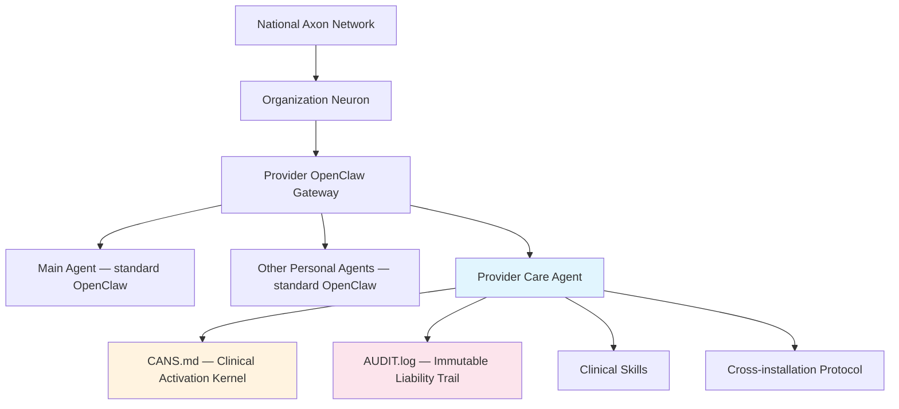
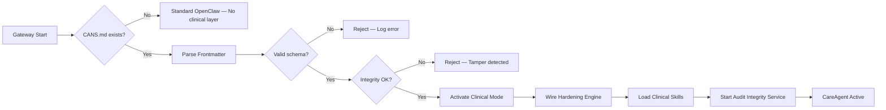
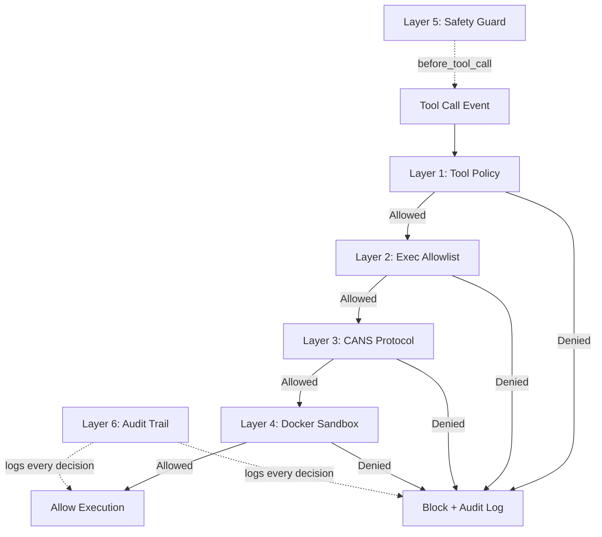

# Architecture Guide

@careagent/provider-core is a plugin into OpenClaw — not a fork of it. It transforms a standard OpenClaw personal AI agent into a credentialed, auditable, hardened clinical agent governed by the Irreducible Risk Hypothesis. OpenClaw workspace files (SOUL.md, AGENTS.md, etc.) are the instructional layer — they tell the LLM who it is and how to behave. LLM behavior is probabilistic. This plugin is the deterministic layer. Audit logging, credential validation, hardening enforcement, and the safety guard all run as code in-process with the Gateway — regardless of LLM behavior. The LLM handles clinical intelligence. The plugin handles governance. Governance cannot be probabilistic when a provider's liability is attached to every action the agent takes.

---

## Ecosystem Overview

@careagent/provider-core is one component in a larger clinical AI ecosystem. The diagram below shows where the plugin sits relative to the other ecosystem components.



**National Axon Network** is the open foundation network layer and communication protocol ([careagent/axon](https://github.com/careagent/axon)). It facilitates the initial handshake between provider and patient CareAgents. Clinical content flows peer-to-peer after handshake — Axon is not in the path of clinical communication.

**Organization Neuron** is the organization-level node that serves as the public-facing endpoint for a practice or healthcare organization ([careagent/neuron](https://github.com/careagent/neuron)). The Neuron manages inbound patient CareAgent connections and routes them to the correct provider Care Agent.

**Provider OpenClaw Gateway** is the provider's personal OpenClaw installation. It can host multiple agents — a personal assistant, a scheduling agent, and the clinical Care Agent. This plugin activates the clinical layer on the Care Agent without modifying OpenClaw's core.

Neuron and Axon are separate repositories and ecosystem-level components. They have their own installation, configuration, and lifecycle. A developer working with this plugin does not need to install or configure either one to get a functional clinical agent — they are relevant only when connecting to external patient CareAgents across installations.

---

## CANS: Clinical Activation Mechanism

`CANS.md` (Clinical Activation and Notification System) is a single Markdown file placed in the agent's workspace that activates the entire clinical layer. Its presence is the activation gate: when `CANS.md` exists and validates, clinical mode activates. When it is absent, the plugin takes no action and the agent runs as standard OpenClaw.

CANS.md uses YAML frontmatter to declare the provider's clinical identity and configuration:

- **Provider identity** — name, NPI, provider types, degrees, licenses, certifications, specialty, organizations
- **Scope of practice** — whitelist-only permitted actions (e.g., `chart_operative_note`, `chart_progress_note`)
- **Autonomy tiers** — per-action autonomy configuration for the seven atomic clinical actions

  ```typescript
  type AutonomyTier = 'autonomous' | 'supervised' | 'manual';
  ```

  Each of the seven actions (chart, order, charge, perform, interpret, educate, coordinate) gets an independent tier assignment.

- **Voice directives** — per-action documentation voice preferences (optional)
- **Consent** — HIPAA warning acknowledgment, synthetic-data-only attestation, audit consent, timestamp
- **Skills** — authorized clinical skill list
- **Cross-installation consent** — inbound/outbound patient CareAgent connection permissions (optional)

The existing OpenClaw workspace files remain untouched. CANS.md is purely additive.

For full schema reference, field tables, and annotated examples, see [Configuration Reference](configuration.md).

### Activation Flow

The activation gate runs on every Gateway startup. It follows a strict validation pipeline: any failure at any stage prevents clinical mode from activating.



**Parse Frontmatter** extracts YAML frontmatter from the Markdown file using a standard YAML parser.

**Schema Validation** checks the parsed frontmatter against a TypeBox schema (`CANSSchema` in `src/activation/cans-schema.ts`). Every required field must be present and correctly typed. Validation errors are logged to the audit trail with the specific field paths and messages.

**Integrity Check** computes a SHA-256 hash of the CANS.md file content and compares it against a stored hash. If the file has been modified outside of the approved update flow (onboarding or refinement), the integrity check fails and clinical mode does not activate. This prevents unauthorized tampering with the provider's clinical identity.

See `src/activation/gate.ts` for the full activation gate implementation.

---

## Runtime Hardening

Hardening is core liability architecture. The provider bears personal liability for every action their Care Agent takes. The hardening engine ensures the agent cannot take actions outside its credentialed scope, even if prompted to do so.

Hardening is always on. It is deterministic code, not probabilistic LLM behavior. It is not configurable via CANS.md — when CANS.md activates, all six layers activate unconditionally.

### Six Hardening Layers



The first four layers form a synchronous pipeline with short-circuit-on-deny semantics: a tool call must pass every layer to execute, and the first denial terminates evaluation immediately.

**Layer 1 — Tool Policy Lockdown** (`src/hardening/layers/tool-policy.ts`)
When CANS.md activates, OpenClaw's tool allow/deny lists are configured restrictively. Only tools required for the provider's clinical functions are permitted. Every tool not on the allowlist is denied.

**Layer 2 — Exec Allowlist** (`src/hardening/layers/exec-allowlist.ts`)
All shell execution routes through OpenClaw's exec approval system in allowlist mode. Only pre-approved binary paths are permitted. Any shell command targeting a binary not on the allowlist is denied.

**Layer 3 — CANS Protocol Injection** (`src/hardening/layers/cans-injection.ts`)
Clinical hard rules are injected into the agent's system prompt via the `agent:bootstrap` hook. These rules are derived directly from the CANS.md scope declaration: no modifying audit logs, no bypassing credentialing gates, no unauthorized data access, no actions outside the declared scope. The LLM receives these as immutable context on every session.

**Layer 4 — Docker Sandbox** (`src/hardening/layers/docker-sandbox.ts`)
When available, OpenClaw's Docker sandbox is activated for the agent, providing process-level isolation. If Docker is unavailable, this layer degrades gracefully (allows execution) but logs a warning.

**Layer 5 — Safety Guard (before_tool_call)** (`src/hardening/engine.ts`)
The `before_tool_call` hook intercepts every tool invocation before execution and routes it through the Layer 1-4 pipeline. This is the enforcement point where the hardening engine connects to the host platform's execution flow. Layer 5 is what makes the pipeline active — without it, Layers 1-4 are definitions only.

**Layer 6 — Audit Trail Integration** (`src/hardening/engine.ts`)
Every hardening decision — allow and deny — is recorded in AUDIT.log. Every blocked action includes which layer caught it, what was attempted, and why it was blocked. Layer 6 does not make allow/deny decisions; it records the decisions made by Layers 1-5.

### Hook Liveness Canary (HARD-07)

The hardening engine deploys a canary test (`src/hardening/canary.ts`) that verifies the `before_tool_call` hook actually fires. If the hook is not wired by the host platform within 30 seconds of activation, the canary logs a warning that Layer 5 (Safety Guard) is degraded. This ensures the provider knows if the enforcement point is not functioning.

---

## Clinical Skills Framework

Clinical skills are credentialed capability packages that teach the Care Agent how to perform specific clinical functions. They are OpenClaw skill packages with an additional clinical manifest (`skill-manifest.json`) that declares credential requirements, file checksums, and version pinning.

### Skill Lifecycle

1. **Install** — Skills are installed from the careagent/provider-skills registry as OpenClaw skill packages. Each skill contains a `skill-manifest.json` alongside its standard skill files.

2. **Integrity Verification** — At load time, every file listed in the skill manifest has its SHA-256 checksum verified against the declared value. A modified skill file does not load. This prevents tampering with clinical behavior.

3. **Credential Gating** — The skill manifest declares required credentials (license types, specialties, privileges). The credential validator checks these against the provider's CANS.md declarations. A skill whose requirements exceed the provider's credentials does not load. A family medicine Care Agent does not load a spine surgery skill.

4. **Version Pinning** — Clinical skills do not auto-update. The manifest declares `pinned: true` and an `approved_version`. The provider must explicitly approve version changes before they take effect.

5. **Loading** — Skills that pass integrity, credential, and version checks are loaded into the agent context. Skills that fail any check are blocked and the decision is logged to AUDIT.log.

### chart-skill: Reference Implementation

`chart-skill` is the first clinical skill and serves as the reference implementation. It generates structured clinical documentation (operative notes, H&P, progress notes) using templates — not freeform generation — in the provider's documented clinical voice.

chart-skill respects the provider's voice directives from CANS.md. When a provider configures a chart voice directive (e.g., "terse, no filler, bullet-form assessments"), the skill adapts its documentation output accordingly.

See `skills/chart-skill/` for the skill implementation and `src/skills/manifest-schema.ts` for the manifest schema.

**Note:** Additional skills (order-skill, charge-skill, specialty skills) are planned for future versions and are not part of the current release.

---

## Audit Pipeline

Every action the Care Agent takes is recorded in `.careagent/AUDIT.log` as append-only JSONL (one JSON object per line). The audit trail begins from the first activation and captures the full lifecycle of every clinical interaction.

### Entry Structure

Each audit entry contains:

| Field | Description |
|-------|-------------|
| `schema_version` | Entry schema version (currently `"1"`) |
| `timestamp` | ISO 8601 timestamp |
| `session_id` | UUID identifying the Gateway session |
| `trace_id` | UUID correlating related events within a session |
| `action` | What was done (e.g., `hardening_check`, `activation_check`, `skill_load`) |
| `actor` | Who initiated: `agent`, `provider`, or `system` |
| `outcome` | Result: `allowed`, `denied`, `escalated`, `error`, `active`, `inactive` |
| `action_state` | Clinical workflow state (optional, see below) |
| `details` | Structured metadata specific to the action |
| `prev_hash` | SHA-256 hash of the previous entry (hash chaining) |

### Action States

Clinical actions flow through a defined state lifecycle:

| State | Meaning |
|-------|---------|
| `ai-proposed` | The agent proposed a clinical action |
| `provider-approved` | The provider approved the proposed action |
| `provider-modified` | The provider modified the proposed action before approving |
| `provider-rejected` | The provider rejected the proposed action |
| `system-blocked` | The hardening engine blocked the action before it reached the provider |

### Hash Chaining

Every entry's `prev_hash` field contains the SHA-256 hash of the previous entry's JSON. The first entry in a session uses `null`. This creates a tamper-evident chain: modifying or deleting any entry breaks the chain, and the `verifyChain()` method detects this.

### Audit Integrity Service

A background service (`src/audit/integrity-service.ts`) monitors the audit log's hash chain integrity. It runs periodically and reports any chain breaks to the platform adapter. This provides continuous assurance that the audit trail has not been tampered with.

See `src/audit/pipeline.ts` for the pipeline implementation and `src/audit/entry-schema.ts` for the entry schema.

---

## Repository Structure

```
careagent/provider-core/
├── src/
│   ├── index.ts              # Plugin entry point — re-exports OpenClaw registration
│   ├── activation/           # CANS.md parsing, schema validation, integrity check, activation gate
│   ├── adapters/             # Multi-platform adapter layer (OpenClaw, standalone, agents-standard)
│   ├── audit/                # AUDIT.log writer, pipeline, entry schema, integrity service
│   ├── cli/                  # CLI commands (careagent init, careagent status, careagent proposals)
│   ├── credentials/          # Credential validation against CANS.md
│   ├── entry/                # Platform-specific entry points (openclaw, standalone, core)
│   ├── hardening/            # Six-layer hardening engine, layer implementations, canary
│   ├── neuron/               # Neuron registration and communication (ecosystem stub)
│   ├── onboarding/           # careagent init interview engine, stages, CANS generation
│   ├── protocol/             # Cross-installation channel, server role (ecosystem stub)
│   ├── refinement/           # CANS.md continuous improvement: observations, proposals, write-back
│   ├── skills/               # Skill framework: manifest schema, loader, credential gating, chart-skill
│   └── vendor/               # Vendored dependencies (yaml parser)
├── skills/
│   └── chart-skill/          # Reference clinical skill implementation
├── test/
│   ├── fixtures/             # Test fixtures including valid CANS.md examples
│   ├── integration/          # Integration and E2E tests
│   └── unit/                 # Unit tests per module
├── docs/                     # Documentation guides
├── openclaw.plugin.json      # OpenClaw plugin manifest
└── package.json              # pnpm package — OpenClaw as optional peer dependency
```

**neuron/** and **protocol/** are ecosystem stubs. They define the interfaces for Neuron registration and cross-installation communication but do not contain full implementations. These subsystems depend on external ecosystem components (careagent/neuron, careagent/axon) that have their own repositories.

---

## Single-Agent vs. Multi-Agent Mode

@careagent/provider-core works in both OpenClaw deployment modes.

**Single-agent mode** — The entire OpenClaw installation is dedicated to the provider Care Agent. This is the simplest setup and appropriate for a provider who wants a clinical-only installation. No additional isolation configuration is required.

**Multi-agent mode** — The Care Agent runs alongside other agents on the same installation (a general personal assistant, a scheduling agent, etc.). This requires explicit isolation to ensure the clinical workspace, session history, and audit log are walled off from non-clinical agents:

- `agentToAgent` is disabled on the CareAgent's configuration
- `sessions_send` and `sessions_spawn` are denied in the per-agent tool policy
- Docker sandboxing provides process-level isolation for the clinical runtime
- No other agent on the installation can reach the CareAgent
- The CareAgent communicates only through its bound clinical channels and the cross-installation protocol

The `careagent init` onboarding process asks which mode you are running and configures isolation automatically if multi-agent mode is selected.

---

## Related Resources

- [Installation Guide](installation.md) — Set up OpenClaw and install the plugin
- [Onboarding Walkthrough](onboarding.md) — Run `careagent init` and create your clinical identity
- [Configuration Reference](configuration.md) — Full CANS.md schema, skill manifest format, plugin configuration
